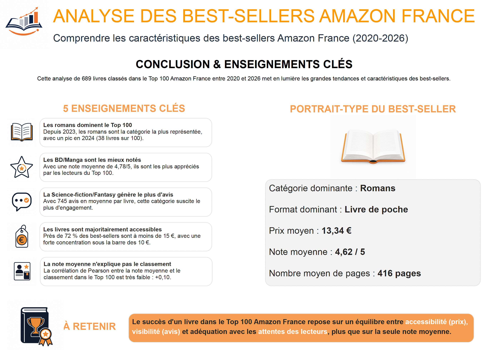

# Analyse des best-sellers Amazon France 2020-2026

## Objectif du projet

Ce projet analyse les livres présents dans le Top 100 Amazon France entre 2020 et 2026 afin d’identifier les catégories dominantes, les tendances d’évolution et les caractéristiques communes aux livres les mieux classés.

L’objectif est de transformer des données brutes en informations exploitables pour mieux comprendre les dynamiques du marché du livre en France : catégories les plus représentées, formats dominants, niveaux de prix, notes moyennes et engagement des lecteurs à travers les avis.

## Problématique

Quels facteurs semblent caractériser les best-sellers Amazon France entre 2020 et 2026 ?

Plus précisément, l’analyse cherche à répondre aux questions suivantes :

- Quelles catégories dominent le Top 100 Amazon France ?
- Comment ces catégories évoluent-elles dans le temps ?
- Quel est le prix moyen des livres les mieux classés ?
- Les livres les mieux notés sont-ils forcément les mieux classés ?
- Quels formats de livres sont les plus présents dans le classement ?
- Quel portrait-type peut-on dresser d’un best-seller Amazon France ?

## Données analysées

Le projet repose sur un jeu de données composé de 689 livres classés dans le Top 100 Amazon France entre 2020 et 2026.

Les principales variables étudiées sont :

- Année de classement
- Titre du livre
- Auteur
- Catégorie principale
- Sous-catégorie
- Prix
- Note moyenne
- Nombre d’avis
- Nombre de pages
- Format du livre
- Classement Amazon

> À noter : les données 2026 sont partielles et couvrent la période jusqu’à mai 2026.

## Compétences mobilisées

- Nettoyage de données
- Structuration de données CSV
- Analyse exploratoire
- Harmonisation de catégories
- Analyse temporelle
- Analyse comparative par catégorie
- Visualisation de données
- Création d’un tableau de bord
- Interprétation des résultats
- Synthèse d’insights

## Outils utilisés

- Python
- Pandas
- Matplotlib
- Excel / CSV
- Looker Studio
- GitHub

## Étapes du projet

1. Importation des fichiers de données
2. Nettoyage et standardisation des colonnes
3. Correction des formats numériques
4. Harmonisation des catégories de livres
5. Analyse exploratoire des données
6. Calcul des indicateurs clés
7. Analyse des tendances par année
8. Création de visualisations
9. Construction du tableau de bord final
10. Synthèse des résultats et limites de l’analyse

## Analyses réalisées

- Répartition des livres par catégorie
- Évolution des catégories entre 2020 et 2026
- Analyse des prix moyens par catégorie
- Analyse des notes moyennes
- Analyse du nombre moyen d’avis
- Répartition des livres par format
- Répartition des livres par tranche de prix
- Étude de la corrélation entre note moyenne et classement
- Identification d’un portrait-type du best-seller Amazon France

## Résultats principaux

L’analyse met en évidence plusieurs tendances fortes :

- Les romans deviennent la catégorie dominante à partir de 2023, avec un pic en 2024.
- Les BD/Manga obtiennent les meilleures notes moyennes.
- La Science-fiction/Fantasy génère le plus d’avis moyens par livre.
- Les livres les mieux classés restent majoritairement accessibles en prix.
- La note moyenne seule explique très peu le classement dans le Top 100.
- Le succès d’un livre semble davantage reposer sur un équilibre entre catégorie, prix, visibilité et adéquation avec les attentes des lecteurs.

## Aperçu du dashboard

## Conclusion

Ce projet montre que les best-sellers Amazon France ne se distinguent pas uniquement par leur note moyenne. Les données suggèrent que la catégorie du livre, son prix, son format et sa visibilité à travers les avis jouent un rôle important dans sa présence dans le Top 100.

L’analyse permet ainsi de mieux comprendre les grandes tendances du marché du livre sur Amazon France et de construire un portrait-type des ouvrages les plus performants.

## Limites de l’analyse

- Les données portent uniquement sur les livres déjà présents dans le Top 100 Amazon France.
- Les ventes réelles ne sont pas disponibles.
- L’année 2026 est incomplète.
- Le classement Amazon peut évoluer rapidement selon la date de collecte.
- Certaines catégories ont été harmonisées manuellement pour faciliter l’analyse.

## Lien vers le dashboard

[Voir le dashboard interactif sur Looker Studio] (https://datastudio.google.com/reporting/2d291cd9-8158-42f4-ab61-f39127464ac6)

## Auteur

Projet réalisé par Rémi TABARD dans le cadre de mon portfolio Data Analyst.
